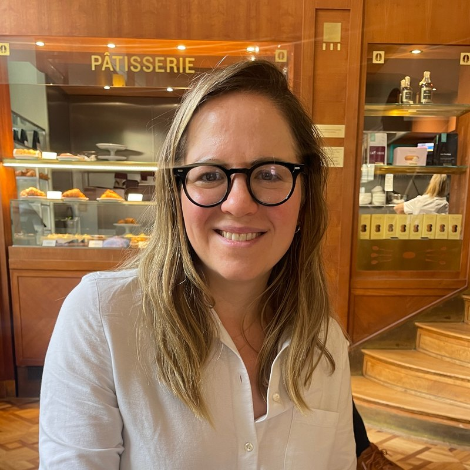

```{=html}
<!-- ==========================================================================
     ABOUT HERO
     The name is a heading here rather than in the top bar; the bar's copy of
     it is hidden on this page by CSS (see "ABOUT PAGE" in styles.scss).
     ========================================================================== -->
<header class="about-hero">
  <h1 class="about-name"><strong>Asya</strong> Magazinnik</h1>
  <p class="about-role">Professor of Social Data Science, Hertie School</p>
</header>

<!-- Photo and bio are two columns of one row, not a float, so every line of
     the bio starts at the same left edge instead of reflowing underneath the
     photo when it runs out. The bio is plain HTML rather than markdown so
     the whole row stays in one block. -->
<div class="about-row">

  <div class="about-side">
    

    <!-- Inline SVG rather than an icon font: Font Awesome or Academicons
         would mean a CDN request on every page load, which is the same
         privacy problem as hotlinking Google Fonts. These cost nothing and
         inherit their colour from the CSS via currentColor. -->
    <p class="about-links">
      <!-- The address is percent-encoded. A browser decodes a mailto URI
           before using it, so this behaves as an ordinary email link, but the
           raw HTML contains no "@" and no readable address for a regex-based
           harvester. Note: HTML entities do NOT work here - pandoc decodes
           them back to plain text when it builds the page. Keep it
           percent-encoded if you edit this. -->
      <a href="mailto:%61%2E%6D%61%67%61%7A%69%6E%6E%69%6B%40%68%65%72%74%69%65%2D%73%63%68%6F%6F%6C%2E%6F%72%67" title="Email" aria-label="Email">
        <svg viewBox="0 0 24 24" fill="none" stroke="currentColor" stroke-width="1.7"
             stroke-linecap="round" stroke-linejoin="round" aria-hidden="true">
          <rect x="2.5" y="5" width="19" height="14" rx="2.5"/>
          <path d="m3 7.5 9 6 9-6"/>
        </svg>
      </a>

      <a href="https://scholar.google.com/citations?user=gZGltbkAAAAJ"
         title="Google Scholar" aria-label="Google Scholar">
        <!-- A mortarboard rather than the Google Scholar logo itself: the
             logo is a diamond over a circle, which mushes into an unreadable
             blob at 21px. This stays legible and matches the envelope. -->
        <svg viewBox="0 0 24 24" fill="none" stroke="currentColor" stroke-width="1.7"
             stroke-linecap="round" stroke-linejoin="round" aria-hidden="true">
          <path d="M22 9 12 5 2 9l10 4 10-4v6"/>
          <path d="M6 10.6V16c0 1.1 2.7 2 6 2s6-.9 6-2v-5.4"/>
        </svg>
      </a>

      <a href="https://github.com/magazinnik" title="GitHub" aria-label="GitHub">
        <svg viewBox="0 0 16 16" fill="currentColor" aria-hidden="true">
          <path d="M8 0C3.58 0 0 3.58 0 8c0 3.54 2.29 6.53 5.47 7.59.4.07.55-.17.55-.38
                   0-.19-.01-.82-.01-1.49-2.01.37-2.53-.49-2.69-.94-.09-.23-.48-.94-.82-1.13
                   -.28-.15-.68-.52-.01-.53.63-.01 1.08.58 1.23.82.72 1.21 1.87.87 2.33.66
                   .07-.52.28-.87.51-1.07-1.78-.2-3.64-.89-3.64-3.95 0-.87.31-1.59.82-2.15
                   -.08-.2-.36-1.02.08-2.12 0 0 .67-.21 2.2.82.64-.18 1.32-.27 2-.27s1.36.09
                   2 .27c1.53-1.04 2.2-.82 2.2-.82.44 1.1.16 1.92.08 2.12.51.56.82 1.27.82
                   2.15 0 3.07-1.87 3.75-3.65 3.95.29.25.54.73.54 1.48 0 1.07-.01 1.93-.01
                   2.2 0 .21.15.46.55.38A8.01 8.01 0 0 0 16 8c0-4.42-3.58-8-8-8Z"/>
        </svg>
      </a>
    </p>
  </div>

  <div class="about-bio">
    <p>Welcome! I am the Professor of Social Data Science at the
    <a href="https://www.hertie-school.org/">Hertie School</a> in Berlin, where
    I am affiliated with the
    <a href="https://www.hertie-school.org/en/datasciencelab">Data Science
    Lab</a> and teach in the Master of Data Science for Public Policy and the
    Master of Public Policy.</p>

    <p>I work at the intersection of causal inference, quantitative methods,
    and game theory to advance the understanding of political representation
    and public goods provision in democratic societies. My work has recently
    appeared in the <em>American Journal of Political Science</em>, the
    <em>Journal of Politics</em>, <em>Political Science Research and
    Methods</em>, and other outlets. My research has received awards from
    APSA&rsquo;s &ldquo;American Political Economy&rdquo; and
    &ldquo;Representation and Electoral Systems&rdquo; sections, and has been
    funded by Arnold Ventures, CIVICA, the Russell Sage Foundation, and the
    National Science Foundation.</p>

    <p>Before joining the Hertie School, I was an Assistant Professor of
    Political Science at MIT. I hold a Ph.D. in Politics from Princeton
    University and an M.P.P. from the University of Chicago Harris School.</p>
  </div>

</div>
```

## Updates

```{=html}
<!-- ==========================================================================
     UPDATES TICKER
     Newest at the top. To add an entry, copy one <li> and edit it. The date
     goes in its own <span> so the dates line up in a column.
     ========================================================================== -->
<ul class="news">

  <li>
    <span class="date">September 2026</span>
    <span>New working paper with Michael Hankinson and Joseph Loffredo:
    &ldquo;<a href="https://papers.ssrn.com/sol3/papers.cfm?abstract_id=7154498">Assessing
    District Elections as a Remedy in State Voting Rights Acts</a>&rdquo;</span>
  </li>

  <li>
    <span class="date">August 2026</span>
    <span>&ldquo;<a href="https://osf.io/preprints/socarxiv/xjre9_v1">Aggregation,
    Interpretation, and Estimation of Preferences in Conjoint
    Experiments</a>&rdquo; (with Scott F Abramson, Korhan Kocak, and Anton
    Strezhnev) is conditionally accepted at <em>PSRM</em>.</span>
  </li>

  <li>
    <span class="date">July 2026</span>
    <span>I gave the keynote at the <a href="https://summerschoolwpm.org/summer-school-2026/">Summer
    School for Women in Political Methodology</a> at the University of
    Mannheim.</span>
  </li>

  <li>
    <span class="date">July 2026</span>
    <span>&ldquo;<a href="https://papers.ssrn.com/sol3/papers.cfm?abstract_id=5372605">Reform
    Drift: How Incumbent Protection Undermines Descriptive Representation in
    Local Government</a>&rdquo; (with Joseph Loffredo and Michael Hankinson) is
    conditionally accepted at <em>AJPS</em>.</span>
  </li>

  <li>
    <span class="date">May 2026</span>
    <span>I hosted the 2026 <a href="https://vim2026.com/">Visions in
    Methodology</a> Conference at the Hertie School.</span>
  </li>

  <li>
    <span class="date">May 2026</span>
    <span>I gave a <a href="talks/polmeth-europe-2026.pdf">keynote</a> on the
    measurement of political preferences at PolMeth Europe in Dublin.</span>
  </li>

  <li>
    <span class="date">April 2026</span>
    <span>&ldquo;<a href="https://doi.org/10.1086/736024">An Agency Perspective
    on Immigration Federalism</a>&rdquo; is forthcoming at the
    <em>JOP</em>.</span>
  </li>

</ul>
```
